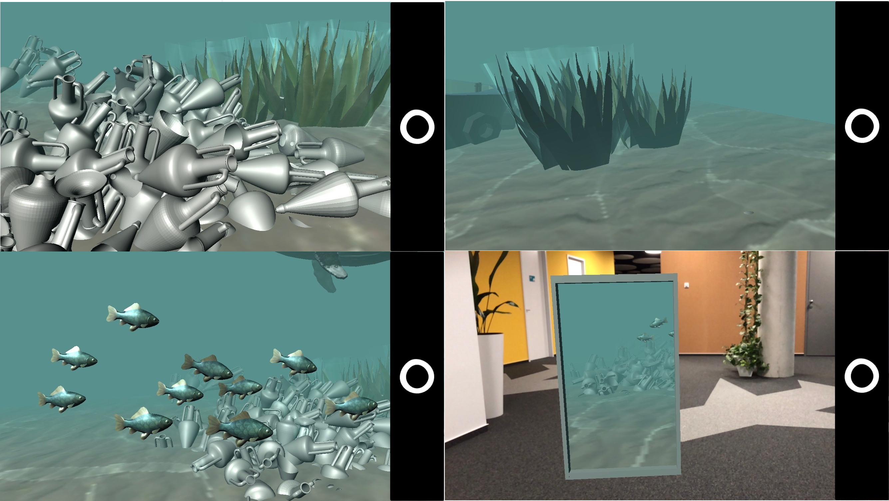
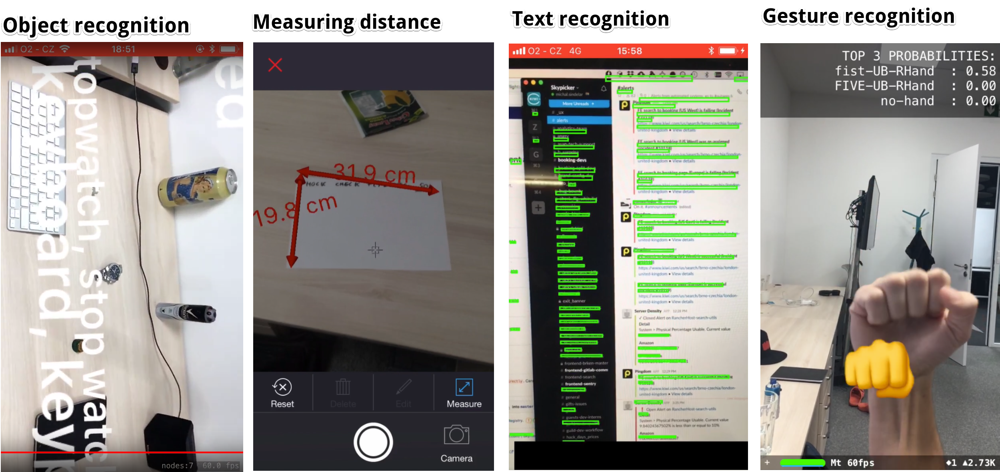

# Augmented Reality research

+  In the late of 2017 I invested time to research in Augmented Reality especially on ARKit and related technologies such as:

    +  Machine Learning based [Vision](https://developer.apple.com/documentation/vision)
    +  Unity ARKit plugin (developing applications in Unity game engine using capabilities of ARKit)

+  All the research was covered by subjects on my Alma Mater [FI MUNI Brno](https://www.fi.muni.cz/) in subjects [PA198](https://is.muni.cz/auth/predmet/fi/podzim2017/PA198) and [PV160](https://is.muni.cz/auth/predmet/fi/podzim2017/PV160)

## Research notes

-  [documentation](./research.md)
-  [mid term presentation](./assets/arkit_presentation.pdf)

## Sample Applications

### Underworld Portal Application
_Underworld excavation in AR using Portal like application_

-  [repository](https://gitlab.fi.muni.cz/xsindel1/underwater-excavation)
    -  must have LDAP account under MUNI

-  [overleaf paper](https://www.overleaf.com/read/mbwqmphcgnjp)
-  [pdf paper](./assets/exploration-underwater-scene.pdf)

### Other samples

- other app

